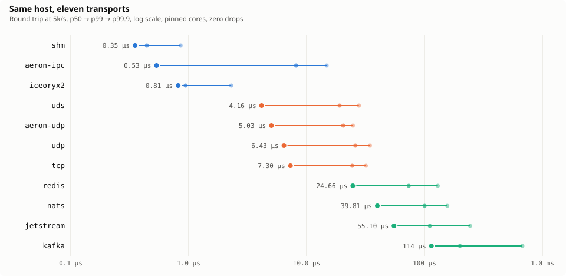
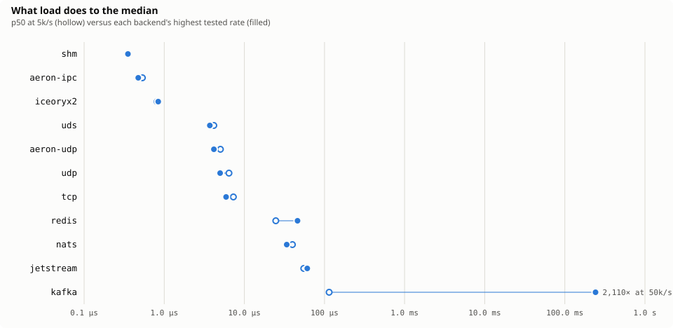
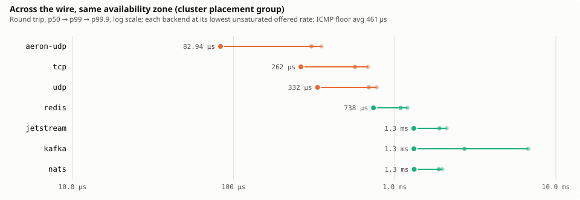
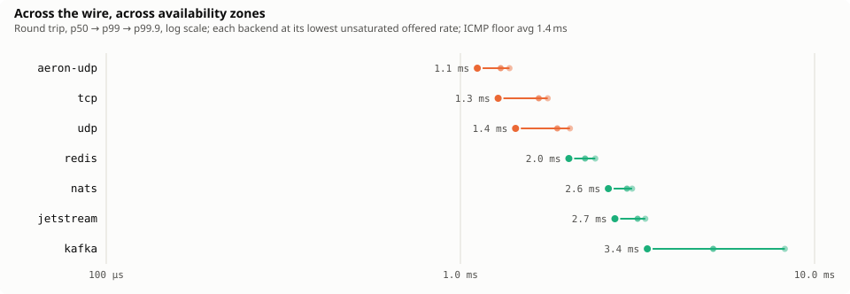

# wire-gauge

**What's the gauge of this wire?** A benchmark comparing ways to move messages
between processes under trading-system-shaped workloads: same-host IPC
(a custom shared-memory ring, iceoryx2, Aeron IPC, Unix domain sockets, TCP
loopback, UDP) and brokered messaging systems (Aeron UDP, NATS core, NATS
JetStream, Redis Streams, Kafka).

Not a production library. The product is the numbers: coordinated-omission-free
latency distributions in `results/`, and a report generated from them, never
hand-typed.

## Round 1 results

<picture>
  <source media="(prefers-color-scheme: dark)" srcset="report/charts/round1-ladder-dark.svg">
  
</picture>

Eleven transports, one machine, one methodology. Round-trip latency in
microseconds at 5,000 messages per second, 128-byte payloads, pinned to
isolated P-cores on Linux. Zero drops in every run.

| Transport | p50 | p99 | p99.9 | Class |
|---|---:|---:|---:|---|
| shm (custom SPSC ring) | 0.35 | 0.44 | 0.85 | shared memory |
| aeron-ipc | 0.53 | 8.15 | 14.81 | shared memory |
| iceoryx2 | 0.81 | 0.94 | 2.29 | shared memory |
| uds | 4.16 | 19.05 | 27.76 | kernel sockets |
| aeron-udp | 5.03 | 20.43 | 24.70 | kernel sockets |
| udp | 6.43 | 25.95 | 34.43 | kernel sockets |
| tcp | 7.30 | 24.41 | 31.86 | kernel sockets |
| redis streams | 24.66 | 73.53 | 129.79 | brokered |
| nats core | 39.81 | 100.29 | 156.16 | brokered |
| nats jetstream | 55.10 | 110.97 | 243.46 | brokered |
| kafka | 114.43 | 199.68 | 676.35 | brokered |

`python3 scripts/table.py` prints every run, including the 50,000 and
100,000 messages-per-second campaigns and the p99.99 and max columns.

<picture>
  <source media="(prefers-color-scheme: dark)" srcset="report/charts/round1-load-dark.svg">
  
</picture>


### Findings worth keeping

- **Kafka at 50,000 messages per second: p50 of 241 milliseconds, zero
  drops.** Every message was delivered. A single-partition, `acks=all`,
  per-message pipeline cannot sustain the rate, so the backlog's sojourn time
  becomes the latency. A load generator that waits for the previous send
  would never see this; the scheduled, coordinated-omission-free generator is
  what makes it visible. The same rate on NATS core costs 34 microseconds.
- **Aeron UDP is as fast as raw UDP sockets at the median.** The reliability
  layer costs almost nothing at p50 because the spinning media driver owns
  the sockets and hands messages to the client over shared memory. Aeron
  pays in the tails instead: p99 of 7 to 8 microseconds on IPC against
  iceoryx2's 0.94.
- **Single-node persistence is cheap; replication is what costs.** JetStream
  and Kafka beat their hypothesized bands by an order of magnitude at low
  rate. The public numbers those hypotheses came from describe clusters.
- **A raw ring is about 2.3x faster than the framework built on the same
  idea.** shm 0.35 microseconds against iceoryx2 0.81. The framework buys
  you discovery, lifetimes, and safety; this is the price.
- **Two methodology lessons the numbers caught:** checking the clock on every
  poll iteration adds visible p99 jitter (spin freely, stride the clock
  checks), and first-touch page faults on a 64K-slot ring cost every 21st
  message 7.5 microseconds at p99 until the mapping was pre-faulted.
- **Platform honesty is measurable.** The shared-memory ring's p99.9 on
  macOS was 1.15 milliseconds. Pinned on Linux it was 8.7 microseconds.
  Nothing about the code changed.

## Round 2 results: across the wire

The network transports re-measured between separate machines on 2026-09-05:
Amazon EC2 c7i.2xlarge, Ubuntu 24.04, one pair in a cluster placement group
inside a single availability zone, one pair across two zones. Same harness,
same schedule-honest generator, echo process and broker on the far host,
both ends pinned to four physical cores. 48 runs.

<picture>
  <source media="(prefers-color-scheme: dark)" srcset="report/charts/round2-same-az-ladder-dark.svg">
  
</picture>

<picture>
  <source media="(prefers-color-scheme: dark)" srcset="report/charts/round2-cross-az-ladder-dark.svg">
  
</picture>

Round-trip medians in microseconds, 128-byte payloads. For the brokered
systems the rate shown is the lowest offered rate at which the client stayed
unsaturated; the saturated rows are in `results/` and the report.

| Transport | Same AZ, 5k/s | Same AZ, 50k/s | Cross AZ, 5k/s | Cross AZ, 50k/s |
|---|---:|---:|---:|---:|
| aeron-udp | 83 | 87 | 1,116 | 1,000 |
| tcp | 262 | 86 | 1,278 | 1,040 |
| udp | 332 | 86 | 1,432 | 1,039 |

| Brokered | Same AZ | at rate | Cross AZ | at rate |
|---|---:|---|---:|---|
| redis streams | 738 | 1k/s | 2,024 | 500/s |
| kafka (acks=all) | 878 | 5k/s | 2,750 | 5k/s |
| nats jetstream | 1,079 | 2k/s | 2,136 | 2k/s |
| nats core | 1,166 | 2k/s | 2,109 | 2k/s |

ICMP round trip on the same pairs, measured by `ping` before each campaign:
same AZ min 0.37 to 0.40 ms, average 0.46 to 0.48 ms; cross AZ min 1.28 to
1.35 ms, average 1.40 to 1.48 ms.

### What the wire changes

- **The idle floor is not the loaded floor.** `ping` said 460 microseconds
  between two hosts in a placement group. At 50,000 messages a second every
  raw transport measured 86. A virtual NIC coalesces interrupts when the
  link is quiet, and ping is always quiet. Benchmark the rate you will run
  at, or you are measuring the hypervisor's idle timer.
- **At low rate, busy-polling is the whole difference.** At 5,000 a second
  Aeron UDP held 83 microseconds while TCP paid 262 and UDP 332. A socket
  that sleeps between messages pays the wakeup on every one; Aeron's
  spinning media driver never sleeps. At 50,000 a second the sockets never
  get to sleep either, and the three converge within a microsecond.
- **A synchronous client cannot exceed one message per round trip, and the
  wire now sets the round trip.** The Redis and NATS clients here confirm
  each message before sending the next. On loopback that cost 25
  microseconds and was invisible. At a 460 microsecond wire it caps
  throughput near 2,000 a second, and across zones near 700. An offered
  5,000 a second to Redis in one zone became a 6 second median. The same to
  Kafka, whose producer pipelines, was 878 microseconds. Round 2's 500, 1,000
  and 2,000 rates exist to measure the synchronous clients under the
  ceiling. The saturated rows stay in the results because they are the
  honest record of what request-response messaging does when the wire gets
  long.
- **Crossing an availability zone adds about 0.9 milliseconds and widens
  nothing.** Aeron UDP at 50,000 a second across zones: p50 1.00 ms, p99 1.03
  ms, zero drops. Distance moved the whole distribution and left the tail
  alone.
- **The first drops of the study.** NATS core at 50,000 a second across zones
  delivered 549,383 of 600,000 messages. Core NATS cuts off a slow consumer
  by design, and at that rate over that wire the echo side was one.
- **Single-node persistence is still cheap on a real wire.** JetStream and
  Kafka sit within 0.3 milliseconds of core NATS on both topologies. The
  replication cost hypothesized in round 1 remains unmeasured: every broker
  here was one node.

## Methodology

`docs/REQUIREMENTS.md` is the plan of record: the candidate set, the
hypotheses, the rules, and the milestones. The rules that matter most:

- **Scheduled load, not closed-loop.** Sends happen on a fixed schedule; a
  slow transport does not slow the generator. Latency is measured from the
  scheduled send time, so coordinated omission is not silently corrected
  away. A separate send-lag histogram is the run-validity check: if it
  grows, the generator is the bottleneck, and the run is discarded.
- **Tails over medians.** Every record carries an HDR histogram; the report
  shows the p50 to p99 to p99.9 ladder, not a bar chart of averages.
- **Genuinely cross-process.** The runner spawns itself as the echo peer.
  Brokers run natively, started before the echo child on non-default ports,
  probed, and killed and swept after each run. No brokers in Docker.
- **Fair pinning.** IPC runs pin to four distinct P-cores with hyperthread
  siblings idle and cpu0 avoided. Brokered runs get a wider pin so the JVM
  broker is not starved.
- **The Mac is a dev loop, not a rig.** Canonical numbers come from one
  Linux machine (i9-13980HX, 62 GB, Linux 6.14, performance governor).
  Relative ordering on macOS holds; the tails do not.

## Running it

Same host:

```sh
cargo build --release
./target/release/wire-gauge rtt shm --rate 5000 --size 128 --duration 10
./target/release/wire-gauge rtt kafka --rate 50000 --out results/local.jsonl
scripts/smoke.sh            # short run of every backend, one line each
python3 scripts/table.py    # the comparison table from results/
python3 scripts/report.py   # regenerate report/wire-gauge-report.html
```

Cross host: run the echo on the far machine and hand its READY line to `rtt`.

```sh
# far host
wire-gauge echo kafka --bind 10.0.0.5:19092 --size 128 --broker    # prints READY 10.0.0.5:19092/wg123
# near host
wire-gauge rtt kafka --peer 10.0.0.5:19092/wg123 --topology lab --rate 2000
```

`infra/aws/` does all of that on rented hardware: `up.sh` creates the
key pair, a tag-scoped security group, a cluster placement group and the
hosts; `provision.sh` installs toolchain and brokers and builds once;
`campaign.sh` runs every topology, backend and rate and appends the records
locally; `down.sh` terminates everything by tag. The IAM identity it runs as
is defined in `infra/iam/` and can launch only in one region and terminate
only what it tagged.

Backends: `shm`, `iceoryx2`, `aeron-ipc`, `aeron-udp`, `uds`, `tcp`, `udp`,
`nats`, `jetstream`, `redis`, `kafka`. The brokered backends expect
`nats-server`, `redis-server`, and a Kafka 4 (KRaft) install on the path;
the runner manages their lifecycle. Aeron is statically linked through
`rusteron` and needs cmake 3.30 or later and libuuid at build time.

## Layout

```
crates/harness         transport traits, scheduled load generator, HDR
                       histograms, JSONL run records with machine metadata
crates/backend-*       one crate per transport family
crates/runner          the wire-gauge binary: rtt scenario, echo peer,
                       broker lifecycle
results/               every canonical run, versioned; runs are the product
infra/                 the AWS rig (up, provision, campaign, down) and its IAM policy
report/                generated HTML report (light and dark), never edited;
                       charts/ holds the same charts as standalone SVGs for this README
scripts/               smoke.sh, table.py, report.py
docs/REQUIREMENTS.md   plan of record
```

## Status

Round 1 complete, 2026-08-31, milestones M0 through M5: methodology,
the IPC axis, the brokered set, Aeron, and the generated report.
Round 2 complete, 2026-09-05, milestone M6: the network transports across a
real wire, same zone and cross zone, on an ephemeral EC2 rig
(`infra/aws/`, under two dollars for the evening).

Open:

- **Replicated brokers.** A three-node JetStream or Kafka to price
  replication, the one round-1 hypothesis still untested.
- **ZeroMQ**, a round-1 candidate that was never built.
- **Round 3:** UDP multicast, Iggy, fan-out and burst scenarios, and
  pipelined clients for Redis and NATS so their cross-host numbers are
  bounded by the broker rather than by the client's request-response loop.

## License

MIT.
